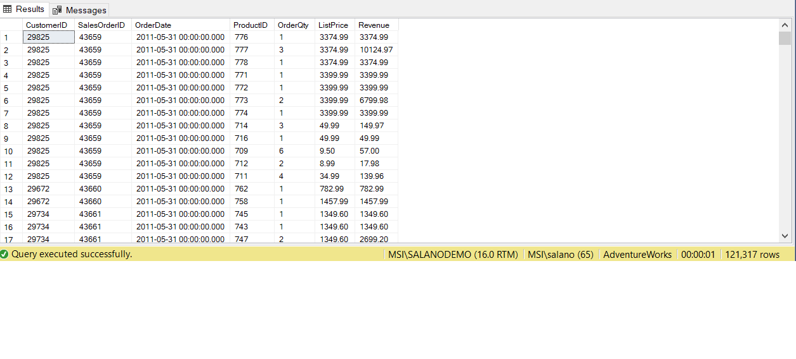
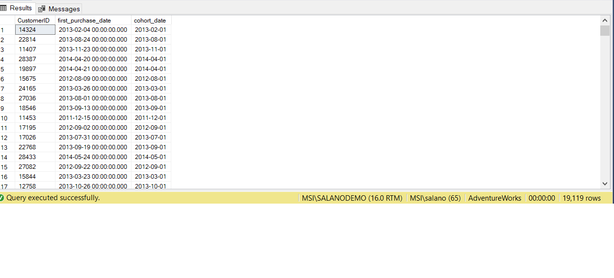
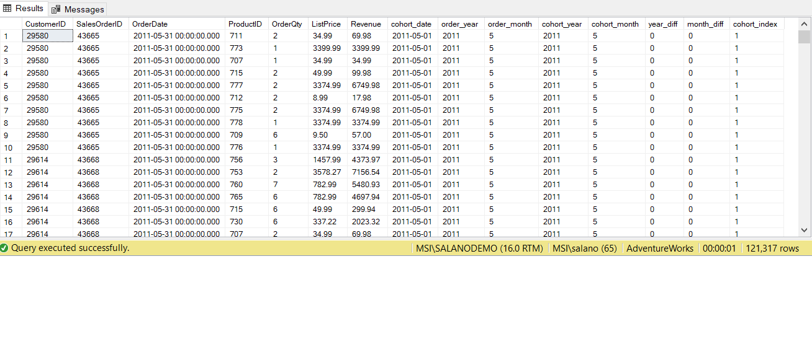
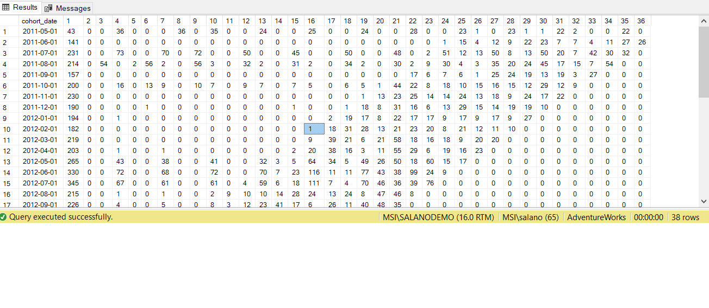
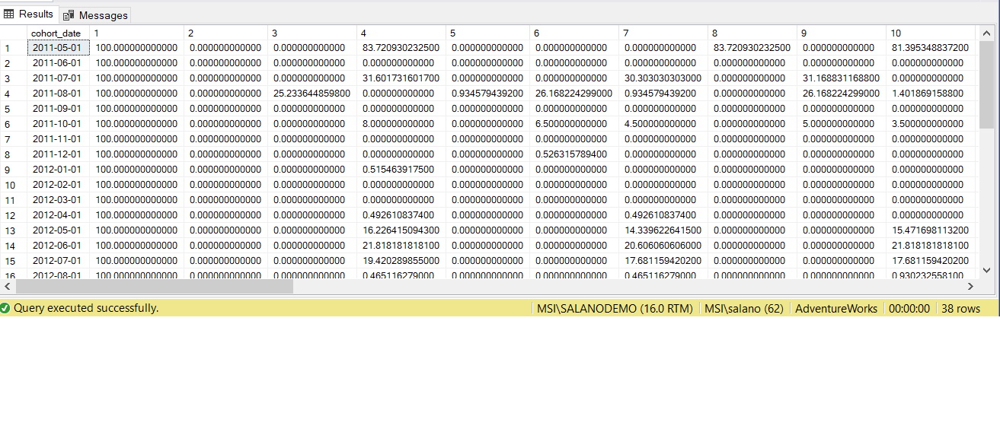
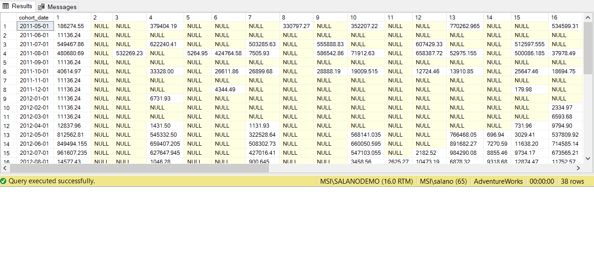
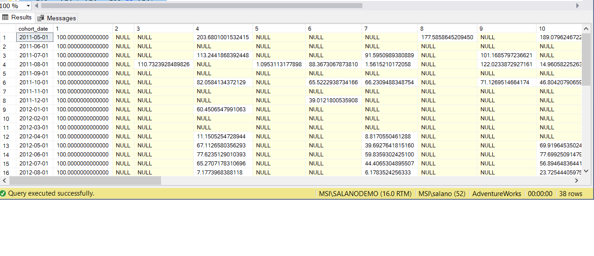
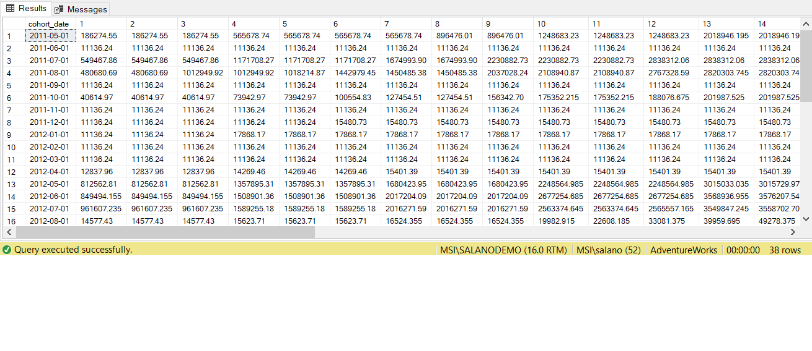
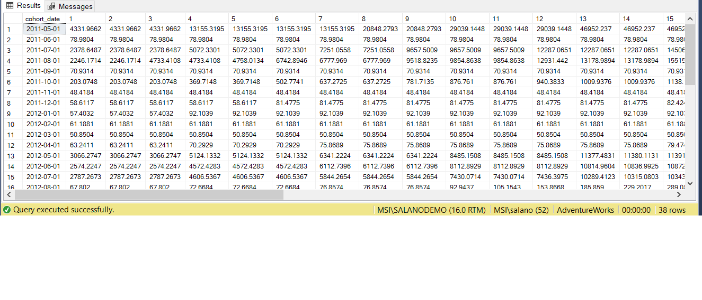
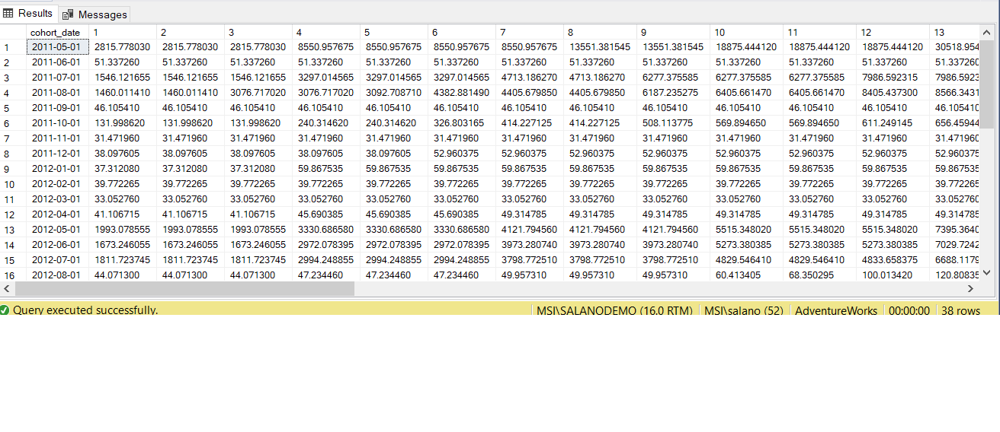

This repository contains the processes to compute cohort, retention, and customer lifetime value analyses in SQL.
The dataset is derived from the AdventureWorks database in MSSQL 2020.

This code stores the customers dataset used in this exercise in the 'Demo.cust_orders' table.

code

```
with cust_orders  as
(
	select
			C.CustomerID,
			SOH.SalesOrderID,
			SOH.OrderDate,
			SOD.ProductID,
			SOD.OrderQty,
			PRD.ListPrice,
			SOD.OrderQty * PRD.ListPrice AS Revenue

		from
			Sales.Customer C
		Join
			Sales.SalesOrderHeader SOH
			on C.CustomerID = SOH.CustomerID
		Join
			Sales.SalesOrderDetail SOD
			on SOH.SalesOrderID = SOD.SalesOrderID
		LEFT JOIN Production.Product PRD
			on PRD.ProductID = SOD.ProductID
)
select
	*
into
	Demo.cust_orders
from
	cust_orders;
```

Results:


We can compute the first order date for each customer and a cohort date (first day in purchase month). We store the results into the 'into Demo.cohort' table.

code

```
select
	CustomerID,
	MIN(OrderDate) as first_purchase_date,
	DATEFROMPARTS(year(min(OrderDate)), MONTH(MIN(OrderDate)),1) as cohort_date
into Demo.cohort
from
	Demo.cust_orders
group by
	CustomerID;
```

Results:


Using the customers and cohort datasets we compute the cohort index and store the new dataset with the cohort index into the 'Demo.retention' table.
The cohort index indicates month of subsequent purchase. Eg 1 - Same month, 2 - Next Month and so forth

code

```
WITH CTE as
(
	select
		o.*,
		c.cohort_date,
		year(o.OrderDate) as order_year,
		month(o.OrderDate) as order_month,
		year(c.cohort_date) as cohort_year,
		month(c.cohort_date) as cohort_month
	from
		Demo.cust_orders o
	left join
		Demo.cohort c
	on c.CustomerID = o.CustomerID
),
CTE2 as
(
	select
		CTE.*,
		year_diff =  order_year - cohort_year,
		month_diff =  order_month - cohort_month
	from
		CTE
)
select
	--cohort index indicates month of subsequent purchase. Eg 1 - Same month, 2 - Next Month and so forth
	CTE2.*,
	year_diff * 12 + month_diff + 1 as cohort_index
into
	Demo.retention
from
	CTE2
```

Results:


We have cohort indices between 1-36 in our retention dataset. We use the retention dataset to count unique orders by customers in each cohort segment (1-36) and store the pivoted results in the table 'Demo.cohort_pivot'.

Code

```
select
	*
into
	Demo.cohort_pivot
from
	(
	select
		distinct
		CustomerID,
		cohort_date,
		cohort_index
	from
		Demo.retention
	)tbl
PIVOT
	(
		count(CustomerID)
		for cohort_index in ([1],[2],[3],[4],[5],[6],[7],[8],[9],[10],[11],[12],[13],[14],[15],[16],[17],[18],[19],[20],[21],[22],[23],[24],[25],[26],[27],[28],[29],[30],[31],[32],[33],[34],[35],[36])
	) AS PIVOT_TABLE
order by
	cohort_date
```

Results:


From the results we can observed in May 2011 (2011-05-01 ) we had 43 new customers and 36 of the new customers placed orders in August 2011 (cohort index 4)

We can calculate the retention by cohort for the customers by dividing the subsequent months count (cohort indices 2-36) by the initial customers count (cohort index 1).

code

```
select
	cohort_date,
	1.0 * [1] / [1] * 100 as [1],
	1.0 * [2] / [1] * 100 as [2],
	1.0 * [3] / [1] * 100 as [3],
	1.0 * [4] / [1] * 100 as [4],
	1.0 * [5] / [1] * 100 as [5],
	1.0 * [6] / [1] * 100 as [6],
	1.0 * [7] / [1] * 100 as [7],
	1.0 * [8] / [1] * 100 as [8],
	1.0 * [9] / [1] * 100 as [9],
	1.0 * [10] / [1] * 100 as [10],
	1.0 * [11] / [1] * 100 as [11],
	1.0 * [12] / [1] * 100 as [12],
	1.0 * [13] / [1] * 100 as [13],
	1.0 * [14] / [1] * 100 as [14],
	1.0 * [15] / [1] * 100 as [15],
	1.0 * [16] / [1] * 100 as [16],
	1.0 * [17] / [1] * 100 as [17],
	1.0 * [18] / [1] * 100 as [18],
	1.0 * [19] / [1] * 100 as [19],
	1.0 * [20] / [1] * 100 as [20],
	1.0 * [21] / [1] * 100 as [21],
	1.0 * [22] / [1] * 100 as [22],
	1.0 * [23] / [1] * 100 as [23],
	1.0 * [24] / [1] * 100 as [24],
	1.0 * [25] / [1] * 100 as [25],
	1.0 * [26] / [1] * 100 as [26],
	1.0 * [27] / [1] * 100 as [27],
	1.0 * [28] / [1] * 100 as [28],
	1.0 * [29] / [1] * 100 as [29],
	1.0 * [30] / [1] * 100 as [30],
	1.0 * [31] / [1] * 100 as [31],
	1.0 * [32] / [1] * 100 as [32],
	1.0 * [33] / [1] * 100 as [33],
	1.0 * [34] / [1] * 100 as [34],
	1.0 * [35] / [1] * 100 as [35],
	1.0 * [36] / [1] * 100 as [36]
from
	Demo.cohort_pivot
order by
	cohort_date;
```

Results:


From the results we can observed that 83.7% of the customers made purchases in August 2011 (cohort index 4) who had an first purchase in May 2011.

We now compute the net revenue by Cohort and store the results in the 'Demo.cohort_revenue_pivot' table.

code

```
select
	*
into
	Demo.cohort_revenue_pivot
from
	(
	select
		distinct
		--CustomerID,
		Revenue,
		cohort_date,
		cohort_index
	from
		Demo.retention
	)tbl
PIVOT
	(
		sum(Revenue)
		for cohort_index in ([1],[2],[3],[4],[5],[6],[7],[8],[9],[10],[11],[12],[13],[14],[15],[16],[17],[18],[19],[20],[21],[22],[23],[24],[25],[26],[27],[28],[29],[30],[31],[32],[33],[34],[35],[36])
	) AS PIVOT_TABLE
order by
	cohort_date
```

Results:


We can compute the net revenue retention by dividing the subsequent months sum (cohort indices 2-36) by the initial months sum (cohort index 1).

code

```

select
	cohort_date,
	1.0 * [1] / [1] * 100 as [1],
	1.0 * [2] / [1] * 100 as [2],
	1.0 * [3] / [1] * 100 as [3],
	1.0 * [4] / [1] * 100 as [4],
	1.0 * [5] / [1] * 100 as [5],
	1.0 * [6] / [1] * 100 as [6],
	1.0 * [7] / [1] * 100 as [7],
	1.0 * [8] / [1] * 100 as [8],
	1.0 * [9] / [1] * 100 as [9],
	1.0 * [10] / [1] * 100 as [10],
	1.0 * [11] / [1] * 100 as [11],
	1.0 * [12] / [1] * 100 as [12],
	1.0 * [13] / [1] * 100 as [13],
	1.0 * [14] / [1] * 100 as [14],
	1.0 * [15] / [1] * 100 as [15],
	1.0 * [16] / [1] * 100 as [16],
	1.0 * [17] / [1] * 100 as [17],
	1.0 * [18] / [1] * 100 as [18],
	1.0 * [19] / [1] * 100 as [19],
	1.0 * [20] / [1] * 100 as [20],
	1.0 * [21] / [1] * 100 as [21],
	1.0 * [22] / [1] * 100 as [22],
	1.0 * [23] / [1] * 100 as [23],
	1.0 * [24] / [1] * 100 as [24],
	1.0 * [25] / [1] * 100 as [25],
	1.0 * [26] / [1] * 100 as [26],
	1.0 * [27] / [1] * 100 as [27],
	1.0 * [28] / [1] * 100 as [28],
	1.0 * [29] / [1] * 100 as [29],
	1.0 * [30] / [1] * 100 as [30],
	1.0 * [31] / [1] * 100 as [31],
	1.0 * [32] / [1] * 100 as [32],
	1.0 * [33] / [1] * 100 as [33],
	1.0 * [34] / [1] * 100 as [34],
	1.0 * [35] / [1] * 100 as [35],
	1.0 * [36] / [1] * 100 as [36]
from
	Demo.cohort_revenue_pivot
order by
	cohort_date
```

Results:


The result shows that revenue more than double in August 2011 (cohort index 4) to 203.7% although less customers made purchases from those initially purchasing in May 2011.

We can calculate the Cummulative Lifetime Revenue by Cohort

code

```
select
	cohort_date,
	ISNULL ([1],0) as [1],
	ISNULL ([1],0)+ISNULL ([2],0) as [2],
	ISNULL ([1],0)+ISNULL ([2],0)+ISNULL ([3],0) as [3],
	ISNULL ([1],0)+ISNULL ([2],0)+ISNULL ([3],0)+ISNULL ([4],0) as [4],
	ISNULL ([1],0)+ISNULL ([2],0)+ISNULL ([3],0)+ISNULL ([4],0)+ISNULL ([5],0) as [5],
	ISNULL ([1],0)+ISNULL ([2],0)+ISNULL ([3],0)+ISNULL ([4],0)+ISNULL ([5],0)+ISNULL ([6],0) as [6],
	ISNULL ([1],0)+ISNULL ([2],0)+ISNULL ([3],0)+ISNULL ([4],0)+ISNULL ([5],0)+ISNULL ([6],0)+ISNULL ([7],0) as [7],
	ISNULL ([1],0)+ISNULL ([2],0)+ISNULL ([3],0)+ISNULL ([4],0)+ISNULL ([5],0)+ISNULL ([6],0)+ISNULL ([7],0)+ISNULL ([8],0) as [8],
	ISNULL ([1],0)+ISNULL ([2],0)+ISNULL ([3],0)+ISNULL ([4],0)+ISNULL ([5],0)+ISNULL ([6],0)+ISNULL ([7],0)+ISNULL ([8],0)+ISNULL ([9],0) as [9],ISNULL ([1],0)+ISNULL ([2],0)+ISNULL ([3],0)+ISNULL ([4],0)+ISNULL ([5],0)+ISNULL ([6],0)+ISNULL ([7],0)+ISNULL ([8],0)+ISNULL ([9],0)+ISNULL
	([10],0) as [10],
	ISNULL ([1],0)+ISNULL ([2],0)+ISNULL ([3],0)+ISNULL ([4],0)+ISNULL ([5],0)+ISNULL ([6],0)+ISNULL ([7],0)+ISNULL ([8],0)+ISNULL ([9],0)+ISNULL
	([10],0)+ISNULL ([11],0) as [11],
	ISNULL ([1],0)+ISNULL ([2],0)+ISNULL ([3],0)+ISNULL ([4],0)+ISNULL ([5],0)+ISNULL ([6],0)+ISNULL ([7],0)+ISNULL ([8],0)+ISNULL ([9],0)+ISNULL
	([10],0)+ISNULL ([11],0)+ISNULL ([12],0) as [12],
	ISNULL ([1],0)+ISNULL ([2],0)+ISNULL ([3],0)+ISNULL ([4],0)+ISNULL ([5],0)+ISNULL ([6],0)+ISNULL ([7],0)+ISNULL ([8],0)+ISNULL ([9],0)+ISNULL
	([10],0)+ISNULL ([11],0)+ISNULL ([12],0)+ISNULL ([13],0) as [13],
	ISNULL ([1],0)+ISNULL ([2],0)+ISNULL ([3],0)+ISNULL ([4],0)+ISNULL ([5],0)+ISNULL ([6],0)+ISNULL ([7],0)+ISNULL ([8],0)+ISNULL ([9],0)+ISNULL
	([10],0)+ISNULL ([11],0)+ISNULL ([12],0)+ISNULL ([13],0)+ISNULL ([14],0) as [14],
	ISNULL ([1],0)+ISNULL ([2],0)+ISNULL ([3],0)+ISNULL ([4],0)+ISNULL ([5],0)+ISNULL ([6],0)+ISNULL ([7],0)+ISNULL ([8],0)+ISNULL ([9],0)+ISNULL
	([10],0)+ISNULL ([11],0)+ISNULL ([12],0)+ISNULL ([13],0)+ISNULL ([14],0)+ISNULL ([15],0) as [15],
	ISNULL ([1],0)+ISNULL ([2],0)+ISNULL ([3],0)+ISNULL ([4],0)+ISNULL ([5],0)+ISNULL ([6],0)+ISNULL ([7],0)+ISNULL ([8],0)+ISNULL ([9],0)+ISNULL
	([10],0)+ISNULL ([11],0)+ISNULL ([12],0)+ISNULL ([13],0)+ISNULL ([14],0)+ISNULL ([15],0)+ISNULL ([16],0) as [16],
	ISNULL ([1],0)+ISNULL ([2],0)+ISNULL ([3],0)+ISNULL ([4],0)+ISNULL ([5],0)+ISNULL ([6],0)+ISNULL ([7],0)+ISNULL ([8],0)+ISNULL ([9],0)+ISNULL
	([10],0)+ISNULL ([11],0)+ISNULL ([12],0)+ISNULL ([13],0)+ISNULL ([14],0)+ISNULL ([15],0)+ISNULL ([16],0)+ISNULL ([17],0) as [17],
	ISNULL ([1],0)+ISNULL ([2],0)+ISNULL ([3],0)+ISNULL ([4],0)+ISNULL ([5],0)+ISNULL ([6],0)+ISNULL ([7],0)+ISNULL ([8],0)+ISNULL ([9],0)+ISNULL
	([10],0)+ISNULL ([11],0)+ISNULL ([12],0)+ISNULL ([13],0)+ISNULL ([14],0)+ISNULL ([15],0)+ISNULL ([16],0)+ISNULL ([17],0)+ISNULL ([18],0) as [18],
	ISNULL ([1],0)+ISNULL ([2],0)+ISNULL ([3],0)+ISNULL ([4],0)+ISNULL ([5],0)+ISNULL ([6],0)+ISNULL ([7],0)+ISNULL ([8],0)+ISNULL ([9],0)+ISNULL
	([10],0)+ISNULL ([11],0)+ISNULL ([12],0)+ISNULL ([13],0)+ISNULL ([14],0)+ISNULL ([15],0)+ISNULL ([16],0)+ISNULL ([17],0)+ISNULL ([18],0)+ISNULL ([19],0) as [19],
	ISNULL ([1],0)+ISNULL ([2],0)+ISNULL ([3],0)+ISNULL ([4],0)+ISNULL ([5],0)+ISNULL ([6],0)+ISNULL ([7],0)+ISNULL ([8],0)+ISNULL ([9],0)+ISNULL
	([10],0)+ISNULL ([11],0)+ISNULL ([12],0)+ISNULL ([13],0)+ISNULL ([14],0)+ISNULL ([15],0)+ISNULL ([16],0)+ISNULL ([17],0)+ISNULL ([18],0)+ISNULL ([19],0)+ISNULL ([20],0) as [20],
	ISNULL ([1],0)+ISNULL ([2],0)+ISNULL ([3],0)+ISNULL ([4],0)+ISNULL ([5],0)+ISNULL ([6],0)+ISNULL ([7],0)+ISNULL ([8],0)+ISNULL ([9],0)+ISNULL
	([10],0)+ISNULL ([11],0)+ISNULL ([12],0)+ISNULL ([13],0)+ISNULL ([14],0)+ISNULL ([15],0)+ISNULL ([16],0)+ISNULL ([17],0)+ISNULL ([18],0)+ISNULL ([19],0)+ISNULL ([20],0)+ISNULL ([21],0) as [21],
	ISNULL ([1],0)+ISNULL ([2],0)+ISNULL ([3],0)+ISNULL ([4],0)+ISNULL ([5],0)+ISNULL ([6],0)+ISNULL ([7],0)+ISNULL ([8],0)+ISNULL ([9],0)+ISNULL
	([10],0)+ISNULL ([11],0)+ISNULL ([12],0)+ISNULL ([13],0)+ISNULL ([14],0)+ISNULL ([15],0)+ISNULL ([16],0)+ISNULL ([17],0)+ISNULL ([18],0)+ISNULL ([19],0)+ISNULL ([20],0)+ISNULL ([21],0)+ISNULL ([22],0) as [22],
	ISNULL ([1],0)+ISNULL ([2],0)+ISNULL ([3],0)+ISNULL ([4],0)+ISNULL ([5],0)+ISNULL ([6],0)+ISNULL ([7],0)+ISNULL ([8],0)+ISNULL ([9],0)+ISNULL
	([10],0)+ISNULL ([11],0)+ISNULL ([12],0)+ISNULL ([13],0)+ISNULL ([14],0)+ISNULL ([15],0)+ISNULL ([16],0)+ISNULL ([17],0)+ISNULL ([18],0)+ISNULL ([19],0)+ISNULL ([20],0)+ISNULL ([21],0)+ISNULL ([22],0)+ISNULL ([23],0) as [23],
	ISNULL ([1],0)+ISNULL ([2],0)+ISNULL ([3],0)+ISNULL ([4],0)+ISNULL ([5],0)+ISNULL ([6],0)+ISNULL ([7],0)+ISNULL ([8],0)+ISNULL ([9],0)+ISNULL
	([10],0)+ISNULL ([11],0)+ISNULL ([12],0)+ISNULL ([13],0)+ISNULL ([14],0)+ISNULL ([15],0)+ISNULL ([16],0)+ISNULL ([17],0)+ISNULL ([18],0)+ISNULL ([19],0)+ISNULL ([20],0)+ISNULL ([21],0)+ISNULL ([22],0)+ISNULL ([23],0)+ISNULL ([24],0) as [24],
	ISNULL ([1],0)+ISNULL ([2],0)+ISNULL ([3],0)+ISNULL ([4],0)+ISNULL ([5],0)+ISNULL ([6],0)+ISNULL ([7],0)+ISNULL ([8],0)+ISNULL ([9],0)+ISNULL
	([10],0)+ISNULL ([11],0)+ISNULL ([12],0)+ISNULL ([13],0)+ISNULL ([14],0)+ISNULL ([15],0)+ISNULL ([16],0)+ISNULL ([17],0)+ISNULL ([18],0)+ISNULL ([19],0)+ISNULL ([20],0)+ISNULL ([21],0)+ISNULL ([22],0)+ISNULL ([23],0)+ISNULL ([24],0)+ISNULL ([25],0) as [25],
	ISNULL ([1],0)+ISNULL ([2],0)+ISNULL ([3],0)+ISNULL ([4],0)+ISNULL ([5],0)+ISNULL ([6],0)+ISNULL ([7],0)+ISNULL ([8],0)+ISNULL ([9],0)+ISNULL
	([10],0)+ISNULL ([11],0)+ISNULL ([12],0)+ISNULL ([13],0)+ISNULL ([14],0)+ISNULL ([15],0)+ISNULL ([16],0)+ISNULL ([17],0)+ISNULL ([18],0)+ISNULL ([19],0)+ISNULL ([20],0)+ISNULL ([21],0)+ISNULL ([22],0)+ISNULL ([23],0)+ISNULL ([24],0)+ISNULL ([25],0)+ISNULL ([26],0) as [26],
	ISNULL ([1],0)+ISNULL ([2],0)+ISNULL ([3],0)+ISNULL ([4],0)+ISNULL ([5],0)+ISNULL ([6],0)+ISNULL ([7],0)+ISNULL ([8],0)+ISNULL ([9],0)+ISNULL
	([10],0)+ISNULL ([11],0)+ISNULL ([12],0)+ISNULL ([13],0)+ISNULL ([14],0)+ISNULL ([15],0)+ISNULL ([16],0)+ISNULL ([17],0)+ISNULL ([18],0)+ISNULL ([19],0)+ISNULL ([20],0)+ISNULL ([21],0)+ISNULL ([22],0)+ISNULL ([23],0)+ISNULL ([24],0)+ISNULL ([25],0)+ISNULL ([26],0)+ISNULL ([27],0) as
	[27],
	ISNULL ([1],0)+ISNULL ([2],0)+ISNULL ([3],0)+ISNULL ([4],0)+ISNULL ([5],0)+ISNULL ([6],0)+ISNULL ([7],0)+ISNULL ([8],0)+ISNULL ([9],0)+ISNULL
	([10],0)+ISNULL ([11],0)+ISNULL ([12],0)+ISNULL ([13],0)+ISNULL ([14],0)+ISNULL ([15],0)+ISNULL ([16],0)+ISNULL ([17],0)+ISNULL ([18],0)+ISNULL ([19],0)+ISNULL ([20],0)+ISNULL ([21],0)+ISNULL ([22],0)+ISNULL ([23],0)+ISNULL ([24],0)+ISNULL ([25],0)+ISNULL ([26],0)+ISNULL ([27],0)+ISNULL ([28],0) as [28],
	ISNULL ([1],0)+ISNULL ([2],0)+ISNULL ([3],0)+ISNULL ([4],0)+ISNULL ([5],0)+ISNULL ([6],0)+ISNULL ([7],0)+ISNULL ([8],0)+ISNULL ([9],0)+ISNULL
	([10],0)+ISNULL ([11],0)+ISNULL ([12],0)+ISNULL ([13],0)+ISNULL ([14],0)+ISNULL ([15],0)+ISNULL ([16],0)+ISNULL ([17],0)+ISNULL ([18],0)+ISNULL ([19],0)+ISNULL ([20],0)+ISNULL ([21],0)+ISNULL ([22],0)+ISNULL ([23],0)+ISNULL ([24],0)+ISNULL ([25],0)+ISNULL ([26],0)+ISNULL ([27],0)+ISNULL ([28],0)+ISNULL ([29],0) as [29],
	ISNULL ([1],0)+ISNULL ([2],0)+ISNULL ([3],0)+ISNULL ([4],0)+ISNULL ([5],0)+ISNULL ([6],0)+ISNULL ([7],0)+ISNULL ([8],0)+ISNULL ([9],0)+ISNULL
	([10],0)+ISNULL ([11],0)+ISNULL ([12],0)+ISNULL ([13],0)+ISNULL ([14],0)+ISNULL ([15],0)+ISNULL ([16],0)+ISNULL ([17],0)+ISNULL ([18],0)+ISNULL ([19],0)+ISNULL ([20],0)+ISNULL ([21],0)+ISNULL ([22],0)+ISNULL ([23],0)+ISNULL ([24],0)+ISNULL ([25],0)+ISNULL ([26],0)+ISNULL ([27],0)+ISNULL ([28],0)+ISNULL ([29],0)+ISNULL ([30],0) as [30],
	ISNULL ([1],0)+ISNULL ([2],0)+ISNULL ([3],0)+ISNULL ([4],0)+ISNULL ([5],0)+ISNULL ([6],0)+ISNULL ([7],0)+ISNULL ([8],0)+ISNULL ([9],0)+ISNULL
	([10],0)+ISNULL ([11],0)+ISNULL ([12],0)+ISNULL ([13],0)+ISNULL ([14],0)+ISNULL ([15],0)+ISNULL ([16],0)+ISNULL ([17],0)+ISNULL ([18],0)+ISNULL ([19],0)+ISNULL ([20],0)+ISNULL ([21],0)+ISNULL ([22],0)+ISNULL ([23],0)+ISNULL ([24],0)+ISNULL ([25],0)+ISNULL ([26],0)+ISNULL ([27],0)+ISNULL ([28],0)+ISNULL ([29],0)+ISNULL ([30],0)+ISNULL ([31],0) as [31],
	ISNULL ([1],0)+ISNULL ([2],0)+ISNULL ([3],0)+ISNULL ([4],0)+ISNULL ([5],0)+ISNULL ([6],0)+ISNULL ([7],0)+ISNULL ([8],0)+ISNULL ([9],0)+ISNULL
	([10],0)+ISNULL ([11],0)+ISNULL ([12],0)+ISNULL ([13],0)+ISNULL ([14],0)+ISNULL ([15],0)+ISNULL ([16],0)+ISNULL ([17],0)+ISNULL ([18],0)+ISNULL ([19],0)+ISNULL ([20],0)+ISNULL ([21],0)+ISNULL ([22],0)+ISNULL ([23],0)+ISNULL ([24],0)+ISNULL ([25],0)+ISNULL ([26],0)+ISNULL ([27],0)+ISNULL ([28],0)+ISNULL ([29],0)+ISNULL ([30],0)+ISNULL ([31],0)+ISNULL ([32],0) as [32],
	ISNULL ([1],0)+ISNULL ([2],0)+ISNULL ([3],0)+ISNULL ([4],0)+ISNULL ([5],0)+ISNULL ([6],0)+ISNULL ([7],0)+ISNULL ([8],0)+ISNULL ([9],0)+ISNULL
	([10],0)+ISNULL ([11],0)+ISNULL ([12],0)+ISNULL ([13],0)+ISNULL ([14],0)+ISNULL ([15],0)+ISNULL ([16],0)+ISNULL ([17],0)+ISNULL ([18],0)+ISNULL ([19],0)+ISNULL ([20],0)+ISNULL ([21],0)+ISNULL ([22],0)+ISNULL ([23],0)+ISNULL ([24],0)+ISNULL ([25],0)+ISNULL ([26],0)+ISNULL ([27],0)+ISNULL ([28],0)+ISNULL ([29],0)+ISNULL ([30],0)+ISNULL ([31],0)+ISNULL ([32],0)+ISNULL ([33],0) as [33],
	ISNULL ([1],0)+ISNULL ([2],0)+ISNULL ([3],0)+ISNULL ([4],0)+ISNULL ([5],0)+ISNULL ([6],0)+ISNULL ([7],0)+ISNULL ([8],0)+ISNULL ([9],0)+ISNULL
	([10],0)+ISNULL ([11],0)+ISNULL ([12],0)+ISNULL ([13],0)+ISNULL ([14],0)+ISNULL ([15],0)+ISNULL ([16],0)+ISNULL ([17],0)+ISNULL ([18],0)+ISNULL ([19],0)+ISNULL ([20],0)+ISNULL ([21],0)+ISNULL ([22],0)+ISNULL ([23],0)+ISNULL ([24],0)+ISNULL ([25],0)+ISNULL ([26],0)+ISNULL ([27],0)+ISNULL ([28],0)+ISNULL ([29],0)+ISNULL ([30],0)+ISNULL ([31],0)+ISNULL ([32],0)+ISNULL ([33],0)+ISNULL ([34],0) as [34],
	ISNULL ([1],0)+ISNULL ([2],0)+ISNULL ([3],0)+ISNULL ([4],0)+ISNULL ([5],0)+ISNULL ([6],0)+ISNULL ([7],0)+ISNULL ([8],0)+ISNULL ([9],0)+ISNULL
	([10],0)+ISNULL ([11],0)+ISNULL ([12],0)+ISNULL ([13],0)+ISNULL ([14],0)+ISNULL ([15],0)+ISNULL ([16],0)+ISNULL ([17],0)+ISNULL ([18],0)+ISNULL ([19],0)+ISNULL ([20],0)+ISNULL ([21],0)+ISNULL ([22],0)+ISNULL ([23],0)+ISNULL ([24],0)+ISNULL ([25],0)+ISNULL ([26],0)+ISNULL ([27],0)+ISNULL ([28],0)+ISNULL ([29],0)+ISNULL ([30],0)+ISNULL ([31],0)+ISNULL ([32],0)+ISNULL ([33],0)+ISNULL ([34],0)+ISNULL ([35],0) as [35],
	ISNULL ([1],0)+ISNULL ([2],0)+ISNULL ([3],0)+ISNULL ([4],0)+ISNULL ([5],0)+ISNULL ([6],0)+ISNULL ([7],0)+ISNULL ([8],0)+ISNULL ([9],0)+ISNULL
	([10],0)+ISNULL ([11],0)+ISNULL ([12],0)+ISNULL ([13],0)+ISNULL ([14],0)+ISNULL ([15],0)+ISNULL ([16],0)+ISNULL ([17],0)+ISNULL ([18],0)+ISNULL ([19],0)+ISNULL ([20],0)+ISNULL ([21],0)+ISNULL ([22],0)+ISNULL ([23],0)+ISNULL ([24],0)+ISNULL ([25],0)+ISNULL ([26],0)+ISNULL ([27],0)+ISNULL ([28],0)+ISNULL ([29],0)+ISNULL ([30],0)+ISNULL ([31],0)+ISNULL ([32],0)+ISNULL ([33],0)+ISNULL ([34],0)+ISNULL ([35],0)+ISNULL ([36],0) as [36]
from
	Demo.cohort_revenue_pivot
	order by
	cohort_date;
```

Results:


We now calculate the Customer liferime revenue by cohort

```
with CUM_LTV_cohort as
(
	select
		cohort_date,
		ISNULL ([1],0) as [1],
		ISNULL ([1],0)+ISNULL ([2],0) as [2],
		ISNULL ([1],0)+ISNULL ([2],0)+ISNULL ([3],0) as [3],
		ISNULL ([1],0)+ISNULL ([2],0)+ISNULL ([3],0)+ISNULL ([4],0) as [4],
		ISNULL ([1],0)+ISNULL ([2],0)+ISNULL ([3],0)+ISNULL ([4],0)+ISNULL ([5],0) as [5],
		ISNULL ([1],0)+ISNULL ([2],0)+ISNULL ([3],0)+ISNULL ([4],0)+ISNULL ([5],0)+ISNULL ([6],0) as [6],
		ISNULL ([1],0)+ISNULL ([2],0)+ISNULL ([3],0)+ISNULL ([4],0)+ISNULL ([5],0)+ISNULL ([6],0)+ISNULL ([7],0) as [7],
		ISNULL ([1],0)+ISNULL ([2],0)+ISNULL ([3],0)+ISNULL ([4],0)+ISNULL ([5],0)+ISNULL ([6],0)+ISNULL ([7],0)+ISNULL ([8],0) as [8],
		ISNULL ([1],0)+ISNULL ([2],0)+ISNULL ([3],0)+ISNULL ([4],0)+ISNULL ([5],0)+ISNULL ([6],0)+ISNULL ([7],0)+ISNULL ([8],0)+ISNULL ([9],0) as [9],ISNULL ([1],0)+ISNULL ([2],0)+ISNULL ([3],0)+ISNULL ([4],0)+ISNULL ([5],0)+ISNULL ([6],0)+ISNULL ([7],0)+ISNULL ([8],0)+ISNULL ([9],0)+ISNULL
		([10],0) as [10],
		ISNULL ([1],0)+ISNULL ([2],0)+ISNULL ([3],0)+ISNULL ([4],0)+ISNULL ([5],0)+ISNULL ([6],0)+ISNULL ([7],0)+ISNULL ([8],0)+ISNULL ([9],0)+ISNULL
		([10],0)+ISNULL ([11],0) as [11],
		ISNULL ([1],0)+ISNULL ([2],0)+ISNULL ([3],0)+ISNULL ([4],0)+ISNULL ([5],0)+ISNULL ([6],0)+ISNULL ([7],0)+ISNULL ([8],0)+ISNULL ([9],0)+ISNULL
		([10],0)+ISNULL ([11],0)+ISNULL ([12],0) as [12],
		ISNULL ([1],0)+ISNULL ([2],0)+ISNULL ([3],0)+ISNULL ([4],0)+ISNULL ([5],0)+ISNULL ([6],0)+ISNULL ([7],0)+ISNULL ([8],0)+ISNULL ([9],0)+ISNULL
		([10],0)+ISNULL ([11],0)+ISNULL ([12],0)+ISNULL ([13],0) as [13],
		ISNULL ([1],0)+ISNULL ([2],0)+ISNULL ([3],0)+ISNULL ([4],0)+ISNULL ([5],0)+ISNULL ([6],0)+ISNULL ([7],0)+ISNULL ([8],0)+ISNULL ([9],0)+ISNULL
		([10],0)+ISNULL ([11],0)+ISNULL ([12],0)+ISNULL ([13],0)+ISNULL ([14],0) as [14],
		ISNULL ([1],0)+ISNULL ([2],0)+ISNULL ([3],0)+ISNULL ([4],0)+ISNULL ([5],0)+ISNULL ([6],0)+ISNULL ([7],0)+ISNULL ([8],0)+ISNULL ([9],0)+ISNULL
		([10],0)+ISNULL ([11],0)+ISNULL ([12],0)+ISNULL ([13],0)+ISNULL ([14],0)+ISNULL ([15],0) as [15],
		ISNULL ([1],0)+ISNULL ([2],0)+ISNULL ([3],0)+ISNULL ([4],0)+ISNULL ([5],0)+ISNULL ([6],0)+ISNULL ([7],0)+ISNULL ([8],0)+ISNULL ([9],0)+ISNULL
		([10],0)+ISNULL ([11],0)+ISNULL ([12],0)+ISNULL ([13],0)+ISNULL ([14],0)+ISNULL ([15],0)+ISNULL ([16],0) as [16],
		ISNULL ([1],0)+ISNULL ([2],0)+ISNULL ([3],0)+ISNULL ([4],0)+ISNULL ([5],0)+ISNULL ([6],0)+ISNULL ([7],0)+ISNULL ([8],0)+ISNULL ([9],0)+ISNULL
		([10],0)+ISNULL ([11],0)+ISNULL ([12],0)+ISNULL ([13],0)+ISNULL ([14],0)+ISNULL ([15],0)+ISNULL ([16],0)+ISNULL ([17],0) as [17],
		ISNULL ([1],0)+ISNULL ([2],0)+ISNULL ([3],0)+ISNULL ([4],0)+ISNULL ([5],0)+ISNULL ([6],0)+ISNULL ([7],0)+ISNULL ([8],0)+ISNULL ([9],0)+ISNULL
		([10],0)+ISNULL ([11],0)+ISNULL ([12],0)+ISNULL ([13],0)+ISNULL ([14],0)+ISNULL ([15],0)+ISNULL ([16],0)+ISNULL ([17],0)+ISNULL ([18],0) as [18],
		ISNULL ([1],0)+ISNULL ([2],0)+ISNULL ([3],0)+ISNULL ([4],0)+ISNULL ([5],0)+ISNULL ([6],0)+ISNULL ([7],0)+ISNULL ([8],0)+ISNULL ([9],0)+ISNULL
		([10],0)+ISNULL ([11],0)+ISNULL ([12],0)+ISNULL ([13],0)+ISNULL ([14],0)+ISNULL ([15],0)+ISNULL ([16],0)+ISNULL ([17],0)+ISNULL ([18],0)+ISNULL ([19],0) as [19],
		ISNULL ([1],0)+ISNULL ([2],0)+ISNULL ([3],0)+ISNULL ([4],0)+ISNULL ([5],0)+ISNULL ([6],0)+ISNULL ([7],0)+ISNULL ([8],0)+ISNULL ([9],0)+ISNULL
		([10],0)+ISNULL ([11],0)+ISNULL ([12],0)+ISNULL ([13],0)+ISNULL ([14],0)+ISNULL ([15],0)+ISNULL ([16],0)+ISNULL ([17],0)+ISNULL ([18],0)+ISNULL ([19],0)+ISNULL ([20],0) as [20],
		ISNULL ([1],0)+ISNULL ([2],0)+ISNULL ([3],0)+ISNULL ([4],0)+ISNULL ([5],0)+ISNULL ([6],0)+ISNULL ([7],0)+ISNULL ([8],0)+ISNULL ([9],0)+ISNULL
		([10],0)+ISNULL ([11],0)+ISNULL ([12],0)+ISNULL ([13],0)+ISNULL ([14],0)+ISNULL ([15],0)+ISNULL ([16],0)+ISNULL ([17],0)+ISNULL ([18],0)+ISNULL ([19],0)+ISNULL ([20],0)+ISNULL ([21],0) as [21],
		ISNULL ([1],0)+ISNULL ([2],0)+ISNULL ([3],0)+ISNULL ([4],0)+ISNULL ([5],0)+ISNULL ([6],0)+ISNULL ([7],0)+ISNULL ([8],0)+ISNULL ([9],0)+ISNULL
		([10],0)+ISNULL ([11],0)+ISNULL ([12],0)+ISNULL ([13],0)+ISNULL ([14],0)+ISNULL ([15],0)+ISNULL ([16],0)+ISNULL ([17],0)+ISNULL ([18],0)+ISNULL ([19],0)+ISNULL ([20],0)+ISNULL ([21],0)+ISNULL ([22],0) as [22],
		ISNULL ([1],0)+ISNULL ([2],0)+ISNULL ([3],0)+ISNULL ([4],0)+ISNULL ([5],0)+ISNULL ([6],0)+ISNULL ([7],0)+ISNULL ([8],0)+ISNULL ([9],0)+ISNULL
		([10],0)+ISNULL ([11],0)+ISNULL ([12],0)+ISNULL ([13],0)+ISNULL ([14],0)+ISNULL ([15],0)+ISNULL ([16],0)+ISNULL ([17],0)+ISNULL ([18],0)+ISNULL ([19],0)+ISNULL ([20],0)+ISNULL ([21],0)+ISNULL ([22],0)+ISNULL ([23],0) as [23],
		ISNULL ([1],0)+ISNULL ([2],0)+ISNULL ([3],0)+ISNULL ([4],0)+ISNULL ([5],0)+ISNULL ([6],0)+ISNULL ([7],0)+ISNULL ([8],0)+ISNULL ([9],0)+ISNULL
		([10],0)+ISNULL ([11],0)+ISNULL ([12],0)+ISNULL ([13],0)+ISNULL ([14],0)+ISNULL ([15],0)+ISNULL ([16],0)+ISNULL ([17],0)+ISNULL ([18],0)+ISNULL ([19],0)+ISNULL ([20],0)+ISNULL ([21],0)+ISNULL ([22],0)+ISNULL ([23],0)+ISNULL ([24],0) as [24],
		ISNULL ([1],0)+ISNULL ([2],0)+ISNULL ([3],0)+ISNULL ([4],0)+ISNULL ([5],0)+ISNULL ([6],0)+ISNULL ([7],0)+ISNULL ([8],0)+ISNULL ([9],0)+ISNULL
		([10],0)+ISNULL ([11],0)+ISNULL ([12],0)+ISNULL ([13],0)+ISNULL ([14],0)+ISNULL ([15],0)+ISNULL ([16],0)+ISNULL ([17],0)+ISNULL ([18],0)+ISNULL ([19],0)+ISNULL ([20],0)+ISNULL ([21],0)+ISNULL ([22],0)+ISNULL ([23],0)+ISNULL ([24],0)+ISNULL ([25],0) as [25],
		ISNULL ([1],0)+ISNULL ([2],0)+ISNULL ([3],0)+ISNULL ([4],0)+ISNULL ([5],0)+ISNULL ([6],0)+ISNULL ([7],0)+ISNULL ([8],0)+ISNULL ([9],0)+ISNULL
		([10],0)+ISNULL ([11],0)+ISNULL ([12],0)+ISNULL ([13],0)+ISNULL ([14],0)+ISNULL ([15],0)+ISNULL ([16],0)+ISNULL ([17],0)+ISNULL ([18],0)+ISNULL ([19],0)+ISNULL ([20],0)+ISNULL ([21],0)+ISNULL ([22],0)+ISNULL ([23],0)+ISNULL ([24],0)+ISNULL ([25],0)+ISNULL ([26],0) as [26],
		ISNULL ([1],0)+ISNULL ([2],0)+ISNULL ([3],0)+ISNULL ([4],0)+ISNULL ([5],0)+ISNULL ([6],0)+ISNULL ([7],0)+ISNULL ([8],0)+ISNULL ([9],0)+ISNULL
		([10],0)+ISNULL ([11],0)+ISNULL ([12],0)+ISNULL ([13],0)+ISNULL ([14],0)+ISNULL ([15],0)+ISNULL ([16],0)+ISNULL ([17],0)+ISNULL ([18],0)+ISNULL ([19],0)+ISNULL ([20],0)+ISNULL ([21],0)+ISNULL ([22],0)+ISNULL ([23],0)+ISNULL ([24],0)+ISNULL ([25],0)+ISNULL ([26],0)+ISNULL ([27],0) as
		[27],
		ISNULL ([1],0)+ISNULL ([2],0)+ISNULL ([3],0)+ISNULL ([4],0)+ISNULL ([5],0)+ISNULL ([6],0)+ISNULL ([7],0)+ISNULL ([8],0)+ISNULL ([9],0)+ISNULL
		([10],0)+ISNULL ([11],0)+ISNULL ([12],0)+ISNULL ([13],0)+ISNULL ([14],0)+ISNULL ([15],0)+ISNULL ([16],0)+ISNULL ([17],0)+ISNULL ([18],0)+ISNULL ([19],0)+ISNULL ([20],0)+ISNULL ([21],0)+ISNULL ([22],0)+ISNULL ([23],0)+ISNULL ([24],0)+ISNULL ([25],0)+ISNULL ([26],0)+ISNULL ([27],0)+ISNULL ([28],0) as [28],
		ISNULL ([1],0)+ISNULL ([2],0)+ISNULL ([3],0)+ISNULL ([4],0)+ISNULL ([5],0)+ISNULL ([6],0)+ISNULL ([7],0)+ISNULL ([8],0)+ISNULL ([9],0)+ISNULL
		([10],0)+ISNULL ([11],0)+ISNULL ([12],0)+ISNULL ([13],0)+ISNULL ([14],0)+ISNULL ([15],0)+ISNULL ([16],0)+ISNULL ([17],0)+ISNULL ([18],0)+ISNULL ([19],0)+ISNULL ([20],0)+ISNULL ([21],0)+ISNULL ([22],0)+ISNULL ([23],0)+ISNULL ([24],0)+ISNULL ([25],0)+ISNULL ([26],0)+ISNULL ([27],0)+ISNULL ([28],0)+ISNULL ([29],0) as [29],
		ISNULL ([1],0)+ISNULL ([2],0)+ISNULL ([3],0)+ISNULL ([4],0)+ISNULL ([5],0)+ISNULL ([6],0)+ISNULL ([7],0)+ISNULL ([8],0)+ISNULL ([9],0)+ISNULL
		([10],0)+ISNULL ([11],0)+ISNULL ([12],0)+ISNULL ([13],0)+ISNULL ([14],0)+ISNULL ([15],0)+ISNULL ([16],0)+ISNULL ([17],0)+ISNULL ([18],0)+ISNULL ([19],0)+ISNULL ([20],0)+ISNULL ([21],0)+ISNULL ([22],0)+ISNULL ([23],0)+ISNULL ([24],0)+ISNULL ([25],0)+ISNULL ([26],0)+ISNULL ([27],0)+ISNULL ([28],0)+ISNULL ([29],0)+ISNULL ([30],0) as [30],
		ISNULL ([1],0)+ISNULL ([2],0)+ISNULL ([3],0)+ISNULL ([4],0)+ISNULL ([5],0)+ISNULL ([6],0)+ISNULL ([7],0)+ISNULL ([8],0)+ISNULL ([9],0)+ISNULL
		([10],0)+ISNULL ([11],0)+ISNULL ([12],0)+ISNULL ([13],0)+ISNULL ([14],0)+ISNULL ([15],0)+ISNULL ([16],0)+ISNULL ([17],0)+ISNULL ([18],0)+ISNULL ([19],0)+ISNULL ([20],0)+ISNULL ([21],0)+ISNULL ([22],0)+ISNULL ([23],0)+ISNULL ([24],0)+ISNULL ([25],0)+ISNULL ([26],0)+ISNULL ([27],0)+ISNULL ([28],0)+ISNULL ([29],0)+ISNULL ([30],0)+ISNULL ([31],0) as [31],
		ISNULL ([1],0)+ISNULL ([2],0)+ISNULL ([3],0)+ISNULL ([4],0)+ISNULL ([5],0)+ISNULL ([6],0)+ISNULL ([7],0)+ISNULL ([8],0)+ISNULL ([9],0)+ISNULL
		([10],0)+ISNULL ([11],0)+ISNULL ([12],0)+ISNULL ([13],0)+ISNULL ([14],0)+ISNULL ([15],0)+ISNULL ([16],0)+ISNULL ([17],0)+ISNULL ([18],0)+ISNULL ([19],0)+ISNULL ([20],0)+ISNULL ([21],0)+ISNULL ([22],0)+ISNULL ([23],0)+ISNULL ([24],0)+ISNULL ([25],0)+ISNULL ([26],0)+ISNULL ([27],0)+ISNULL ([28],0)+ISNULL ([29],0)+ISNULL ([30],0)+ISNULL ([31],0)+ISNULL ([32],0) as [32],
		ISNULL ([1],0)+ISNULL ([2],0)+ISNULL ([3],0)+ISNULL ([4],0)+ISNULL ([5],0)+ISNULL ([6],0)+ISNULL ([7],0)+ISNULL ([8],0)+ISNULL ([9],0)+ISNULL
		([10],0)+ISNULL ([11],0)+ISNULL ([12],0)+ISNULL ([13],0)+ISNULL ([14],0)+ISNULL ([15],0)+ISNULL ([16],0)+ISNULL ([17],0)+ISNULL ([18],0)+ISNULL ([19],0)+ISNULL ([20],0)+ISNULL ([21],0)+ISNULL ([22],0)+ISNULL ([23],0)+ISNULL ([24],0)+ISNULL ([25],0)+ISNULL ([26],0)+ISNULL ([27],0)+ISNULL ([28],0)+ISNULL ([29],0)+ISNULL ([30],0)+ISNULL ([31],0)+ISNULL ([32],0)+ISNULL ([33],0) as [33],
		ISNULL ([1],0)+ISNULL ([2],0)+ISNULL ([3],0)+ISNULL ([4],0)+ISNULL ([5],0)+ISNULL ([6],0)+ISNULL ([7],0)+ISNULL ([8],0)+ISNULL ([9],0)+ISNULL
		([10],0)+ISNULL ([11],0)+ISNULL ([12],0)+ISNULL ([13],0)+ISNULL ([14],0)+ISNULL ([15],0)+ISNULL ([16],0)+ISNULL ([17],0)+ISNULL ([18],0)+ISNULL ([19],0)+ISNULL ([20],0)+ISNULL ([21],0)+ISNULL ([22],0)+ISNULL ([23],0)+ISNULL ([24],0)+ISNULL ([25],0)+ISNULL ([26],0)+ISNULL ([27],0)+ISNULL ([28],0)+ISNULL ([29],0)+ISNULL ([30],0)+ISNULL ([31],0)+ISNULL ([32],0)+ISNULL ([33],0)+ISNULL ([34],0) as [34],
		ISNULL ([1],0)+ISNULL ([2],0)+ISNULL ([3],0)+ISNULL ([4],0)+ISNULL ([5],0)+ISNULL ([6],0)+ISNULL ([7],0)+ISNULL ([8],0)+ISNULL ([9],0)+ISNULL
		([10],0)+ISNULL ([11],0)+ISNULL ([12],0)+ISNULL ([13],0)+ISNULL ([14],0)+ISNULL ([15],0)+ISNULL ([16],0)+ISNULL ([17],0)+ISNULL ([18],0)+ISNULL ([19],0)+ISNULL ([20],0)+ISNULL ([21],0)+ISNULL ([22],0)+ISNULL ([23],0)+ISNULL ([24],0)+ISNULL ([25],0)+ISNULL ([26],0)+ISNULL ([27],0)+ISNULL ([28],0)+ISNULL ([29],0)+ISNULL ([30],0)+ISNULL ([31],0)+ISNULL ([32],0)+ISNULL ([33],0)+ISNULL ([34],0)+ISNULL ([35],0) as [35],
		ISNULL ([1],0)+ISNULL ([2],0)+ISNULL ([3],0)+ISNULL ([4],0)+ISNULL ([5],0)+ISNULL ([6],0)+ISNULL ([7],0)+ISNULL ([8],0)+ISNULL ([9],0)+ISNULL
		([10],0)+ISNULL ([11],0)+ISNULL ([12],0)+ISNULL ([13],0)+ISNULL ([14],0)+ISNULL ([15],0)+ISNULL ([16],0)+ISNULL ([17],0)+ISNULL ([18],0)+ISNULL ([19],0)+ISNULL ([20],0)+ISNULL ([21],0)+ISNULL ([22],0)+ISNULL ([23],0)+ISNULL ([24],0)+ISNULL ([25],0)+ISNULL ([26],0)+ISNULL ([27],0)+ISNULL ([28],0)+ISNULL ([29],0)+ISNULL ([30],0)+ISNULL ([31],0)+ISNULL ([32],0)+ISNULL ([33],0)+ISNULL ([34],0)+ISNULL ([35],0)+ISNULL ([36],0) as [36]
	from
			Demo.cohort_revenue_pivot
)
select
	A.cohort_date,
	  A.[1] / B.[1] as [1],
	 A.[2] / B.[1] as [2],
	 A.[3] / B.[1] as [3],
	 A.[4] / B.[1] as [4],
	 A.[5] / B.[1] as [5],
	 A.[6] / B.[1] as [6],
	 A.[7] / B.[1] as [7],
	 A.[8] / B.[1] as [8],
	 A.[9] / B.[1] as [9],
	 A.[10] / B.[1] as [10],
	 A.[11] / B.[1] as [11],
	 A.[12] / B.[1] as [12],
	 A.[13] / B.[1] as [13],
	 A.[14] / B.[1] as [14],
	 A.[15] / B.[1] as [15],
	 A.[16] / B.[1] as [16],
	 A.[17] / B.[1] as [17],
	 A.[18] / B.[1] as [18],
	 A.[19] / B.[1] as [19],
	 A.[20] / B.[1] as [20],
	 A.[21] / B.[1] as [21],
	 A.[22] / B.[1] as [22],
	 A.[23] / B.[1] as [23],
	 A.[24] / B.[1] as [24],
	 A.[25] / B.[1] as [25],
	 A.[26] / B.[1] as [26],
	 A.[27] / B.[1] as [27],
	 A.[28] / B.[1] as [28],
	 A.[29] / B.[1] as [29],
	 A.[30] / B.[1] as [30],
	 A.[31] / B.[1] as [31],
	 A.[32] / B.[1] as [32],
	 A.[33] / B.[1] as [33],
	 A.[34] / B.[1] as [34],
	 A.[35] / B.[1] as [35],
	 A.[36] / B.[1] as [36]

into
	Demo.Cust_LT_Revenue
from
	CUM_LTV_cohort A
Join
	Demo.cohort_pivot B
on B.cohort_date = A.cohort_date
```

Results:


We now calculate the customer lifetime value assuming a products gross margin of 65%

code

```
select
	cohort_date,
	 [1] * 0.65 as [1],
	 [2] * 0.65 as [2],
	 [3] * 0.65 as [3],
	 [4] * 0.65 as [4],
	 [5] * 0.65 as [5],
	 [6] * 0.65 as [6],
	 [7] * 0.65 as [7],
	 [8] * 0.65 as [8],
	 [9] * 0.65 as [9],
	 [10] * 0.65 as [10],
	 [11] * 0.65 as [11],
	 [12] * 0.65 as [12],
	 [13] * 0.65 as [13],
	 [14] * 0.65 as [14],
	 [15] * 0.65 as [15],
	 [16] * 0.65 as [16],
	 [17] * 0.65 as [17],
	 [18] * 0.65 as [18],
	 [19] * 0.65 as [19],
	 [20] * 0.65 as [20],
	 [21] * 0.65 as [21],
	 [22] * 0.65 as [22],
	 [23] * 0.65 as [23],
	 [24] * 0.65 as [24],
	 [25] * 0.65 as [25],
	 [26] * 0.65 as [26],
	 [27] * 0.65 as [27],
	 [28] * 0.65 as [28],
	 [29] * 0.65 as [29],
	 [30] * 0.65 as [30],
	 [31] * 0.65 as [31],
	 [32] * 0.65 as [32],
	 [33] * 0.65 as [33],
	 [34] * 0.65 as [34],
	 [35] * 0.65 as [35],
	 [36] * 0.65 as [36]
from
	Demo.Cust_LT_Revenue
order by
 cohort_date;

```

Results:


The result illustrates that earned 2815.778030 in revenue in May 2011 and this grew to 8550.957675 in August 2011.
